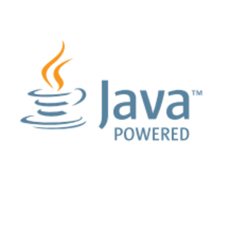

### Hi there, I'm Ahsan👋

- 🌱 I’m currently learning MERN Stack and ML
- 👀 I’m interested in Web & Mobile App Development

 

### Languages and Tools:

<code></code>
<code></code>
<code></code>
<code></code>
<code></code>
<code></code>
<code></code>

---

## &#x1f4c8; My GitHub Stats

